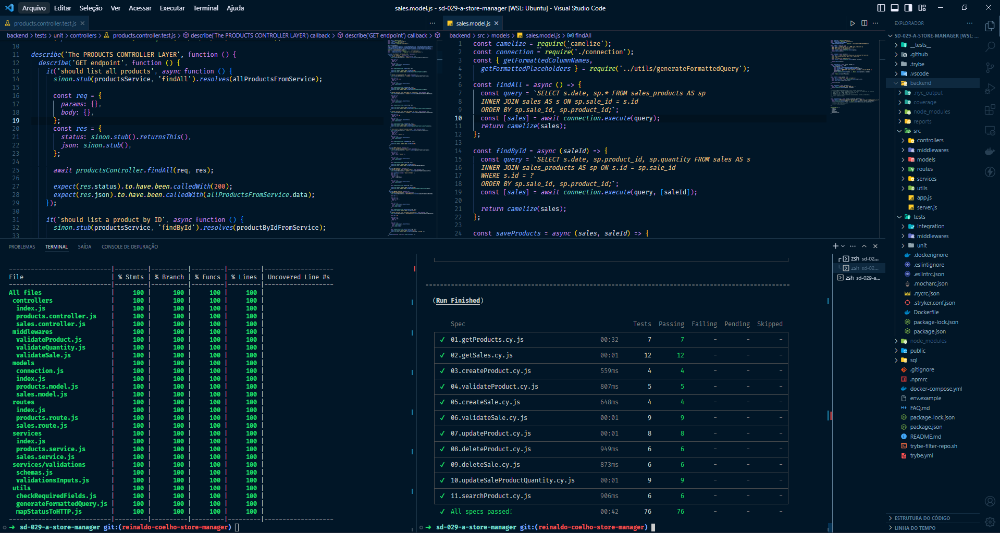
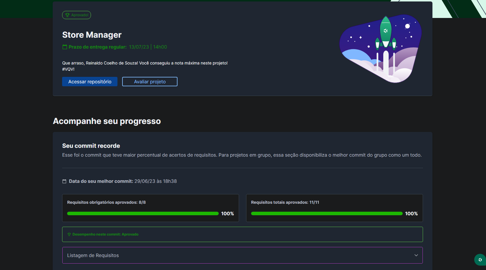

# 🏪 Store Manager

## 📘 Sobre

API RESTful utilizando arquitetura em camadas (model, service e controller). A API é um sistema de gerenciamento de vendas, em que é possível criar, visualizar, deletar e atualizar produtos e vendas (CRUD). Utilizei o MySQL para gerir os dados e cobri 100% da aplicação com testes.
Coloquei em prática meus conhecimentos em Node.js, MySQL, Express.js e Docker. Para os testes, utilizei as bibliotecas mocha, chai e sinon.

## ⚛️ Ferramentas

- Arquitetura em camadas (model, service e controller).
- Node.js;
- Mocha;
- Chai;
- Sinon;
- Express.js;
- Middlewares;
- Docker;
- MySQL.

## 🛠️ Como executar o projeto?

1. Suba os containers da aplicação com `docker-compose up -d`
2. Abra o terminal do container `docker exec -it store_manager sh`

## 🧪 Para executar os testes

1. Entre na pasta backend do projeto `cd backend`
2. Execute o mocha com `npm run test:mocha`

## 📝 Nota

